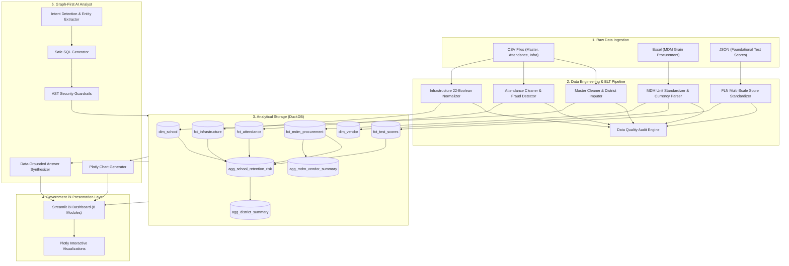

# System Architecture & Technical Specifications

## Student Retention & Welfare Efficacy Tracker
**State Education Department Analytics & AI Decision Support Platform**

---

## 1. Architectural Overview

The platform is designed as an end-to-end, modular, and reproducible data intelligence system structured into three primary tiers:

---

## 2. Component Specifications

### 2.1 Data Engineering & Processing Layer (`pipeline/`)
- **Technology**: Python 3.12+, Pandas, NumPy, Regex.
- **Execution Script**: `python pipeline/run_pipeline.py`.
- **Runtime Performance**: Processes 44,928 raw records, performs deduplication, multidimensional transformations, and writes to DuckDB in **1.65 seconds**.
- **Audit Engine**: Tracks before/after records, null counts, imputed values, unit conversions, and domain anomaly flags in `data/processed/data_quality_audit.csv`.

### 2.2 Analytical Database Layer (`data/processed/education_data.duckdb`)
- **Technology**: DuckDB columnar database.
- **Benefits**:
  - Zero-server embeddable relational database.
  - Sub-millisecond analytical aggregations over tens of thousands of rows.
  - High concurrency support for dashboard sessions.
  - Native support for window functions, string matching, and CTEs.
- **Schema Design**: Star schema with materialized analytical marts (`agg_school_retention_risk`, `agg_district_summary`, `agg_mdm_vendor_summary`).

### 2.3 Web Dashboard Layer (`dashboard/`)
- **Technology**: Python, Streamlit, Plotly.
- **Styling**: Custom Government BI CSS (`dashboard/styles.css`) tailored with clean typography, navy/slate blue palette (`#0F172A`, `#1E3A8A`), responsive metric cards, and accessible colorways.
- **8 Dedicated Modules**:
  1. Executive Overview
  2. Student Retention & Early Warning (SRDRI)
  3. Attendance Integrity & Academic FLN Performance
  4. Mid-Day Meal (MDM) Efficacy & Supply Chain
  5. School Infrastructure & Basic Amenities
  6. School & District Comparison
  7. Data Quality & Pipeline Forensics
  8. AI Graph-First Analyst

### 2.4 Graph-First AI Analyst Layer (`agent/`)
- **Safe Pipeline**:
  `User Question` $\to$ `Intent Detection` $\to$ `Schema Grounding` $\to$ `SQL Generation` $\to$ `AST Security Guardrail` $\to$ `DuckDB Execution` $\to$ `Chart Selection` $\to$ `Data-Grounded Synthesis`
- **Security Features**:
  - Strict AST validation: Permits only analytical `SELECT` and `WITH` (CTE) queries.
  - Hard blocks: `DROP`, `DELETE`, `UPDATE`, `INSERT`, `ALTER`, `TRUNCATE`, `ATTACH`, `COPY`, `PRAGMA`, filesystem access (`read_csv`, `read_parquet`), system commands.
  - Whitelist: Only approved tables and views can be referenced.
- **No Paid APIs Required**: Operates 100% locally and deterministically.
